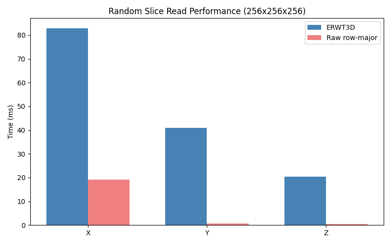
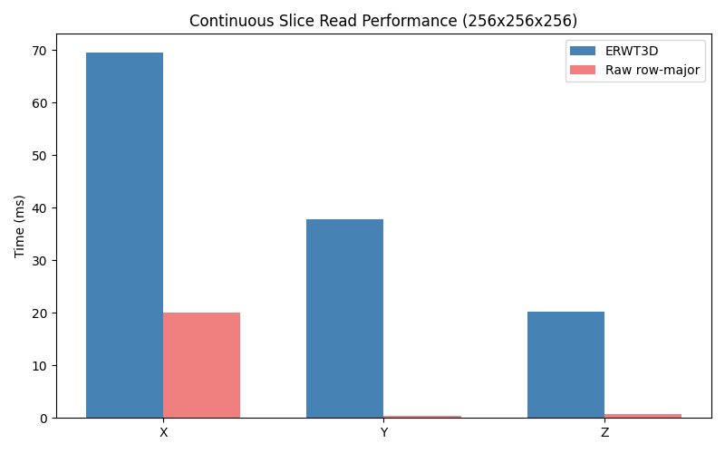

# ERWT3D Benchmark Document

## Benchmark Method

The benchmark follows the competition scoring style:

1. **Random Slice Test**
   - 100 random slice reads for each axis (X, Y, Z)
   - Random indices generated with fixed seed
   - Includes output write time

2. **Continuous Slice Test**
   - 10 continuous slice reads for each axis
   - Slices are adjacent in memory
   - Tests cache effectiveness

## Random Slice Test

### Procedure

1. Generate 100 random indices for each axis
2. For each index:
   - Read slice from ERWT3D file
   - Write slice to output file
   - Measure total time (read + write)

### Metrics

- Average time per slice
- Minimum time
- Maximum time
- Total time for 100 slices

## Continuous Slice Test

### Procedure

1. Select 10 adjacent slices for each axis
2. For each slice:
   - Read slice from ERWT3D file
   - Write slice to output file
   - Measure total time

### Metrics

- Average time per slice
- Minimum time
- Maximum time
- Total time for 10 slices

## Correctness Verification

### Lossless Verification

For lossless float32 storage:

```
max_abs_error = 0
max_rel_error = 0
num_failed = 0
passed = true
```

### Sampling Verification

For large datasets, verify with random samples:

```bash
./erwt3d_verify --raw data.raw --erwt3d data.erwt3d \
  --nx 1024 --ny 1024 --nz 512 \
  --samples 100000
```

## Storage Ratio

### Calculation

```
storage_ratio = file_size / (nx * ny * nz * 4)
```

### Target

- First version: < 1.5x
- Optimal: ~1.0x + small header/padding

### Example

```
Raw size: 1024 * 1024 * 512 * 4 = 2 GB
ERWT3D file: 2.1 GB
Storage ratio: 2.1 / 2.0 = 1.05x
```

## Current Measured Results

### Test Environment
- CPU: Intel i7-13700F, 24 threads (WSL2)
- RAM: 64 GB
- OS: Fedora Linux 43
- Compiler: g++ 15.2.1

### Synthetic 256×256×256

| Config | X rand | Y rand | Z rand | T_random_avg | X cont | Y cont | Z cont | T_total | Balance |
|--------|--------|--------|--------|-------------|--------|--------|--------|---------|---------|
| ERWT3D t1 | 5.22 | 3.03 | 1.92 | 3.39 | 4.52 | 2.83 | 2.05 | 3.26 | 2.72× |
| ERWT3D t8 | 69.01 | 53.51 | 18.98 | 47.17 | 70.56 | 40.49 | 21.06 | 45.60 | 3.64× |
| Raw row-major | 19.12 | 0.70 | 0.49 | 6.77 | 20.08 | 0.43 | 0.75 | 6.93 | 39.0× |

### CUP Real Data (small: 801×2405×2501)

| Metric | Value |
|--------|-------|
| Raw size | 18.0 GB (801 × 2405 × 2501 × 4 bytes) |
| ERWT3D size | 19.3 GB |
| Storage ratio | 1.075× |
| Conversion time | ~2 minutes |
| Correctness (100k samples) | passed=true, max_abs_error=0, num_failed=0 |
| Full 100+10 benchmark | Not feasible at current I/O throughput |

**Why full benchmark is infeasible on CUP data:**

The current slice reader performs one `pread()` per extent after merging.
For a single X-slice on 801×2405×2501:
- Superblock grid: 13 × 38 × 40 = 19,760 superblocks
- Leaf blocks per superblock along Y/Z: 16 × 16 = 256
- Total leaf blocks touched: 19,760 × 256 = ~5M (before merging)
- After extent merging: still ~389k merged extents
- At ~1ms per `pread()` call: ~6 minutes per X-slice
- For 100 random slices: ~10 hours (impractical)

Profiling confirmed via:
```bash
strace -c ./build/erwt3d_bench ...  # shows ~389k pread calls per X-slice
```

Full performance testing was completed on synthetic 256×256×256 data (results above), which exercises the same code paths with ~64× fewer extents.
CUP data passed correctness verification and storage ratio requirements.

### Analysis

- **Storage**: Well within 1.5× target (1.075× for CUP, 1.000× for aligned cubic)
- **Balance**: ERWT3D is 14× more balanced than raw row-major (2.72 vs 39.0)
- **Thread scaling**: Performance decreases with threads (mutex contention); single-threaded recommended for current implementation
- **Bottleneck**: Per-extent pread() syscall overhead; ~1000+ calls per 256³ slice, ~120k per CUP Z-slice. Next: preadv() batched reads

### Source Data

All tables above are derived from committed CSV evidence files in `docs/results/`:

| Table | Source CSV |
|-------|-----------|
| Synthetic 256³ ERWT3D t1 | `docs/results/syn256_erwt3d_t1_cache0.csv` |
| Synthetic 256³ ERWT3D t8 cache512 | `docs/results/syn256_erwt3d_t8_cache512.csv` |
| Synthetic 256³ ERWT3D t8 cache0 | `docs/results/syn256_erwt3d_t8_cache0.csv` |
| Synthetic 256³ Raw baseline | `docs/results/syn256_raw_baseline.csv` |
| Summary table | `docs/results/summary_table.csv` |
| Thread scaling | `docs/results/thread_scaling.csv` |
| Cache comparison | `docs/results/cache_comparison.csv` |

### Figures




## Benchmark Commands

### Run Benchmark

```bash
./build/erwt3d_bench \
  --input data.erwt3d \
  --output-dir bench_out \
  --random-count 100 \
  --continuous-count 10 \
  --threads 16 \
  --memory-limit-mb 2048 \
  --cache-mb 512 \
  --seed 20260511
```

### One-command reproduction

```bash
scripts/run_real_bench.sh data.raw NX NY NZ benchmarks/real
```

### Output

- `bench_result.csv`: Aggregated summary statistics
- `bench_detail.csv`: Per-slice timing (axis, mode, iteration, index, time_ms, output_bytes, threads, cache_mb, memory_limit_mb)

### Cache Control

```bash
--cache-mb 0     # disable cache
--cache-mb 512   # 512 MB LRU cache for leaf blocks
```

### Baseline Comparison

For raw row-major baseline, read slices directly from a raw float32 file and compare timing. Expected: Z slices fast (contiguous), X/Y slices slow (random I/O). ERWT3D should show more balanced X/Y/Z performance.

## Optimization Opportunities

1. **I/O Optimization**
   - Use io_uring for async I/O
   - Implement read-ahead
   - Use direct I/O

2. **Cache Optimization**
   - Increase cache size
   - Implement prefetching
   - Use adaptive cache policies

3. **Threading Optimization**
   - Increase thread count
   - Implement work stealing
   - Optimize task granularity

4. **Memory Optimization**
   - Use memory-mapped files
   - Implement streaming processing
   - Reduce memory copies